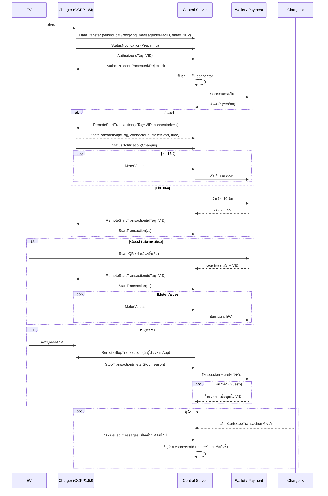

# EV Charging Sequence Flow



หมายเหตุ: DataTransfer ใช้สำหรับส่ง MacID/VID พิเศษ แต่ Authorize และ StartTransaction คือกลไกหลักในการยืนยันตามมาตรฐาน OCPP

## โหมด A: App User (Autocharge)

### เป้าหมายหยุด
- SOC เป้าหมาย (เช่น 80/90/100%)
- ถ้าไม่มีข้อมูล SOC ใช้ target kWh หรือเวลาสูงสุดแทน
- เต็ม 100%
- Soft Cap เวลา 3 ชั่วโมง (ยืดหยุ่น)

### กติกา 3 ชั่วโมงแบบยืดหยุ่น
- 3 ชั่วโมงเป็น Soft Cap ไม่ใช่ตัดทิ้งทันที
- ต่อเวลาอัตโนมัติ ถ้าภายใน 30 นาทีล่าสุดมี "ความคืบหน้า" ใด ๆ ตาม profile ของตู้:
  - หากรายงาน SOC: SOC เพิ่ม ≥ 1% ใน 15 นาที
  - ไม่รายงาน SOC: กำลังเฉลี่ย ≥ max(0.08 × rated_kW, 1.0) ใน 10 นาที
  - หรือ พลังงานเพิ่ม ≥ 0.06 × rated_kW kWh ใน 10 นาที
- ถ้าไม่เข้าเงื่อนไขคืบหน้า:
  - แจ้งเตือนผู้ใช้ก่อนครบ 3 ชม. 10 นาที ให้เลือกต่อเวลา 30 หรือ 60 นาที
  - ถ้าไม่ตอบ → หยุดเมื่อครบเวลา + ระยะผ่อนผัน 5 นาที

### ตรวจจับชาร์จไม่เข้า (Stall Detection)
- SOC เพิ่ม < 1% ใน 20 นาที **และ** กำลังเฉลี่ย < 1.5 kW → ถือว่าค้าง
- แจ้งเตือนในแอป: "ต่อเวลา 15 นาที" หรือ "หยุดเลย"
- ถ้าไม่ตอบภายใน 5 นาที → หยุดอัตโนมัติ

### กติกาเงิน
- ระหว่าง Autocharge ถ้ายอดเงินคงเหลือ < ค่าใช้จ่ายประมาณอีก 10 นาที → แจ้งเตือนให้เติม
- ถ้าเงินเสี่ยงหมด Central จะ RemoteStop ใกล้ขอบเพื่อปิดเซสชันอย่างพอดี
- สามารถตั้ง credit buffer (เช่น 5–10 บาท) ให้ติดลบนิดหน่อยแล้วหักทีหลัง
- ผู้ใช้เติมเงินทีหลัง → กลับสู่ Autocharge ได้ทันทีและผูก VID เพิ่มเติม

### เงื่อนไขหยุดใน Autocharge
- ถึง SOC เป้าหมาย / เต็ม
- เกิน 3 ชม. และไม่เข้าเงื่อนไขคืบหน้า และผู้ใช้ไม่ยืนยันต่อเวลา
- Stall Detection และผู้ใช้ไม่ตอบ
- ผู้ใช้กดหยุด
- ไฟดับแล้วกลับมาแต่ไม่มีความคืบหน้าภายใน 10–15 นาทีแรก
- เงินหมดและไม่เติม

*Resume หลังไฟดับ*: ถ้า Wallet ยังพอและยังไม่ถึงเป้าหมาย ให้ Resume และเริ่มวัดความคืบหน้าใหม่

## โหมด B: Guest (QR Scan — Manual)

- ไม่ใช้ Autocharge
- จ่ายล่วงหน้า → ชาร์จจนเงินหมด / รถเต็ม / ผู้ใช้กดหยุด
- ใช้ Stall Detection เดียวกัน แจ้งบนหน้าจอตู้หรือ SMS; ถ้าไม่ตอบใน 5 นาที → หยุด
- เงินคงเหลือจากการหยุดก่อนเต็ม → เก็บเป็น "เครดิตชั่วคราว" ผูกด้วย VID/เบอร์โทร/ทะเบียน/Token

## VID & การจำผู้ใช้
- App User: VID ผูกกับบัญชีถาวร
- Guest: ออก Temporary VID (QR Token + เบอร์โทร) เพื่อใช้เครดิตครั้งหน้า
- หากลงทะเบียนภายหลัง → ย้ายเครดิตเข้ากระเป๋าได้

## เครดิต Guest และการกันโกง
- เครดิตที่เหลือถูกผูกกับ Temporary VID + เบอร์โทร/ทะเบียน และมีอายุหมดอายุ (เช่น 7 วัน)
- ถ้าถอด–เสียบกลับภายในช่วงสั้น ๆ (เช่น 15 นาที) ที่ connector เดิมและ VID เดิม → ถือว่า resume ไม่ใช่ session ใหม่
- Settlement ปัดเศษ 2 ทศนิยมและรวมภาษี เพื่อป้องกันการฟ้องร้อง

## Idle Fee
- หลัง ChargingComplete สามารถตั้งค่า idle fee (เช่น 2 บาท/นาที) เพื่อกันยึดหัว
- แจ้งเตือนผู้ใช้ล่วงหน้าสองรอบก่อนคิดค่าใช้จ่าย

## เหตุหยุดผิดปกติและการคืนเงิน
- Map เหตุจากตู้ไปยัง StopTransaction.reason มาตรฐาน เช่น GFCI fault, Emergency stop, PowerLoss
- ฝั่ง Central ใช้เหตุเหล่านี้ตัดสินการยกเว้นค่าธรรมเนียมหรือคืนเงินอัตโนมัติ

## หลักฐานมิเตอร์
- ถ้าตู้รองรับให้เปิด SignedMeterValues; ถ้าไม่ ให้เก็บ meterStart/meterStop พร้อม hash ของ payload เพื่อใช้เป็นหลักฐาน

## Pricing Profile
- รองรับหลายรูปแบบ: energy only, energy+time (idle fee), time-of-use (TOU)
- Profile ถูกเลือกตาม connector/ช่วงเวลาและสะท้อนในใบเสร็จ

## ตัวอย่างคอนฟิก
```yaml
pricing:
  rate_per_kwh: 7.00
  idle_fee_per_min_after_complete: 0        # เริ่ม 0, เปิดภายหลังได้
targets:
  prefer_soc: true                         # ถ้ามี SOC
  fallback_target_kwh: 12.0                # ถ้าไม่มี SOC
soft_cap:
  hours: 3
  pre_alert_min: 10
  grace_after_no_response_min: 5
progress_rules:
  use_profile_scaling: true
  min_soc_delta_pct_per_15m: 1.0
  min_power_kw_fraction_of_rated: 0.08     # ≥8% ของพิกัดหรือ ≥1 kW
  min_power_kw_floor: 1.0
  min_energy_kwh_per_10m_fraction_of_rated: 0.06
stall_detection:
  soc_window_min: 20
  power_threshold_kw: 1.5
wallet:
  low_balance_horizon_min: 10
  credit_buffer_baht: 10                   # อนุญาตติดลบเล็กน้อย
guest_credit:
  bind: [phone, temp_vid]
  resume_window_min: 15
  expiry_days: 7
ocpp:
  meter_interval_sec: 15
  require_authorize: true
  signed_meter: false
  tolerate_clock_skew_sec: 120
```

## พารามิเตอร์แนะนำ

| พารามิเตอร์ | ค่าเริ่มต้น | คำอธิบาย |
|---------------|-------------|-----------|
| rate_per_kwh | 7 บาท/kWh | อัตราคิดเงิน |
| soft_cap_hours | 3 ชม. | Soft cap เวลา |
| stall_soc_window | 20 นาที | หน้าต่างตรวจ SOC ค้าง |
| stall_power_threshold_kw | 1.5 kW | ถ้าต่ำกว่าเสี่ยงค้าง |
| extend_prompt_before_soft_cap | 10 นาที | แจ้งเตือนก่อนครบ 3 ชม. |
| extend_duration_options | 30/60 นาที | ต่อเวลาครั้งละกี่นาที |
| grace_after_no_response | 5 นาที | ไม่ตอบแล้วหยุด |
| low_balance_horizon | 10 นาที | ประมาณเงินล่วงหน้า |

*Progress rule ถูกคำนวณตามพิกัดตู้: min_power_kw = max(0.08 × rated_kW, 1.0), min_energy_kwh_10m = 0.06 × rated_kW*

## โครง State Machine (ย่อ)
```
IDLE → PLUGGED → (APP? WALLET_OK → AUTOCHARGE | GUEST → MANUAL)

AUTOCHARGE
    เฝ้า Target SOC / Soft Cap / Stall / Balance
    if SoftCapReached & !Progress & !UserExtend → STOP
    if BalanceLow → RemoteStop (อาจใช้ credit buffer)

MANUAL
    เฝ้า Money / Full / Stall / StopInput
    if MoneyOut or Full or StopInput or StallTimeout → STOP

RESUME หลังไฟดับ → กลับสถานะเดิม (ถ้า Wallet/เครดิตยังพอ) แล้วเริ่มวัด Progress ใหม่

STOP → SETTLEMENT (คำนวณ kWh * rate, คืนเครดิตที่เหลือ, ออกใบเสร็จ)
```

## สัญญาณ/ข้อมูลที่ใช้ตัดสินใจ
- SOC% จากรถ (ถ้ามี; ถ้าไม่มีใช้ Power/Energy)
- Power(kW), Energy(kWh) จากตู้
- เวลาเริ่ม, เวลาเกิน Soft Cap, หน้าต่างเฉลี่ย
- Wallet/เครดิตคงเหลือ
- User Actions: กดหยุด / กดต่อเวลา / เติมเงิน

## API/Hook (โครง)
- `POST /api/v1/sessions/start`
- `POST /api/v1/sessions/{id}/extend`
- `POST /api/v1/wallet/topup`
- `POST /api/v1/sessions/{id}/stop`
- Webhook จากตู้: power, energy, SOC, status, plug_in/out ทุก 5–10 วิ
- Worker ฝั่ง CSMS คำนวณ moving average และตัดสิน progress/stall

## มุมเสถียรภาพ/กู้คืน
- Heartbeat + TimeSync (SetClock) เพื่อกันเวลาเพี้ยน และ Central ยอมรับ clock skew ±120 วินาที
- ตู้ offline → บันทึก Start/StopTransaction แล้วส่งย้อนเมื่อกลับมาออนไลน์ (idempotent)
- ไฟดับ/เน็ตหลุด → บันทึกสถานะทุก 5 วิ, Resume เมื่อกลับมา
- SOC ไม่รายงาน → ใช้ Power/Energy แทนใน progress/stall
- ปลายโค้งชาร์จช้า → ต่อเวลาถ้ายังมี Progress
- กันยึดหัวชาร์จ → Stall + ไม่ตอบ = หยุด พร้อมนโยบาย Idle Fee

แนวทางออกแบบเพื่อให้ได้ “VID” สำหรับรถทุกคัน (โดยไม่ล็อกว่าต้องมี VID แต่รองรับหลายกรณี)

1. แยก “แหล่ง” ที่เป็นไปได้ของ VID
MacID หรือ SN จากตู้

เมื่อเสียบรถใหม่ให้ตู้ส่ง DataTransfer (vendorId=Gresgying, messageId=MacID) เพื่อบอก MacID ของตัวรถ (ถ้ามี)

Central สร้าง VID ถาวรหรือผูก MacID กับ VID (ถ้ามีอยู่) ให้ตู้ใช้อ้างอิง

idTag / Token จากผู้ใช้

Authorize(idTag) ส่งรหัสจาก RFID/App/SMS/QR → Central แปลงเป็น VID หรือใช้เป็น VID ตรง ๆ ได้

ข้อมูลจาก Plug & Charge หรือ ISO15118

หากตู้รองรับ PnC ให้ Central ดึง Certificate ID / VIN → แปลงเป็น VID อัตโนมัติ

ข้อมูลภายนอกที่ผู้ใช้ป้อนเอง (เช่น ทะเบียนรถ / เบอร์โทร)

กรณี Guest หรือระบบที่ยังไม่รองรับ PnC → ใช้ข้อมูลเหล่านี้สร้าง Temporary VID

2. กรอบ “ขั้นตอน” เมื่อรถเสียบตู้
Charger→Central: DataTransfer / StatusNotification(Preparing)

หากมี MacID หรือข้อมูลพิเศษ ส่งขึ้นมา เพื่อ Central ตรวจสอบว่าเคยมี session เดิมไหม

Central สร้าง/ค้นหา VID

ถ้ามีข้อมูลเชื่อมโยง (MacID, token ของ user, เบอร์โทร ฯลฯ) → map ไปยัง VID ที่เก็บไว้

ถ้าไม่พบข้อมูลเลย → สร้าง Temporary VID (เช่น connectorId + timestamp + random)

Authorize

ถ้า require_authorize=true ให้ Authorize(VID) เพื่อให้ตู้รู้จัก VID

กรณี Guest อาจ Authorize ด้วย Temporary VID ที่ Central สร้าง

StartTransaction

เมื่อเริ่มชาร์จ ตู้ส่ง StartTransaction(VID, connectorId, meterStart)

Central บันทึก mapping VID ↔ sessionId ↔ connectorId

3. การรองรับหลายกรณี
กรณี	วิธีได้ VID
App User (Autocharge)	app รู้ข้อมูลรถอยู่แล้ว → ส่ง idTag/Token ให้ตู้→Central จับคู่กับบัญชี ใช้ VID ถาวร
Guest (QR/จ่ายเงินครั้งเดียว)	wallet ส่ง QR token/เบอร์โทร → Central ออก Temporary VID แล้วส่งให้ตู้ RemoteStart
ตู้ Offline	ตู้สร้าง Temporary VID เอง (เช่น UUID) + จับคู่ connectorId
รถ PnC (ISO15118)	ตู้ได้ Certificate/VIN → ส่งให้ Central → สร้าง/ค้นหา VID
กรณีไม่มีข้อมูลเลย	Central สร้าง VID จากเวลา+connector (เช่น VID = hash(connectorId+timestamp)) เพื่อให้ session ดำเนินต่อได้ แล้วผูกข้อมูลทีหลังหากรู้
4. หลังจบ session
Central จัดการ StopTransaction พร้อมข้อมูล VID → user/wallet

ถ้าเป็น Guest และมีเงินเหลือ → เก็บเครดิตผูกกับ Temporary VID + เบอร์โทร/ทะเบียน

หากผู้ใช้ลงทะเบียนภายหลัง → ย้ายเครดิตไปยัง VID ถาวรได้

5. แนวคิดในการป้องกันซ้ำซ้อน/กันโกง
Mapping session ด้วย (connectorId, meterStart) เพื่อป้องกัน Start/StopTransaction ที่ถูกส่งซ้ำตอน offline

รักษา Temporary VID ให้สัมพันธ์กับ connector เดิมภายใน resume window (เช่น 15 นาที) เพื่อถือว่าเป็นการ resume ไม่ใช่ session ใหม่

ใช้ SignedMeterValues หรือเก็บ hash ของ meterStart/Stop เพื่อลดการโกง/แก้ไขข้อมูล

สรุป
ไม่จำเป็นต้องมี VID จาก EV ทันที: Central สามารถ “สร้าง” หรือ “แปลง” info อื่นเป็น VID ภายในได้

รองรับหลายโหมด: App user, Guest, PnC, offline … ทุกกรณีควรได้ข้อมูลเพียงพอเพื่อสร้าง VID ชั่วคราวหรือถาวร

การออกแบบนี้ทำให้ระบบสามารถเริ่มชาร์จได้ก่อน แม้ยังไม่มี VID ชัดเจน แล้วค่อยผูกหรืออัพเดตภายหลัง

แนวทางนี้ช่วยให้โครงสร้างรองรับสถานการณ์หลากหลาย, มีความยืดหยุ่น และไม่ต้องรอให้รถ/ผู้ใช้มี VID ตั้งแต่ต้น แต่ยังสามารถจัดการธุรกรรมชาร์จและผูกข้อมูลภายหลังได้ครบถ้วน.
